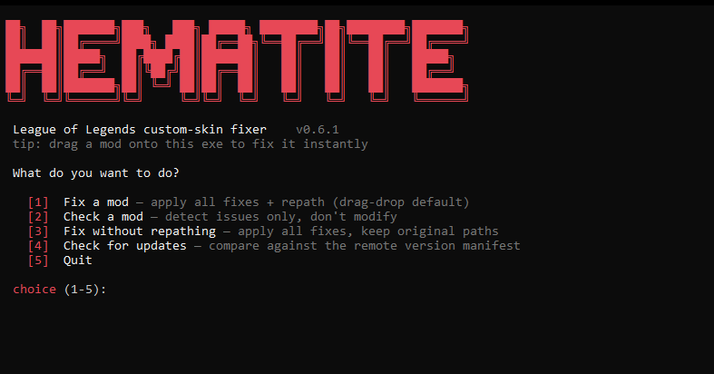

<div align="center">


<h1>Hematite</h1>

[](https://www.rust-lang.org/)
[](https://github.com/RitoShark/Hematite/releases/latest)
[](https://github.com/RitoShark/Hematite/releases/latest)
[](LICENSE)

[Download](#download) · [Features](#features) · [CLI commands](#cli-commands) · [License](#license)

</div>

---

Drop a broken League skin onto Hematite and get a fixed copy back. It repairs outdated data, recovers missing assets from your game install, and sorts out paths so the mod can load again. Install the result with your usual mod manager.

---

## Features

<details open>
<summary><b>Checking and fixing</b> · find what's broken and repair it</summary>

<br>



Drag a mod onto the executable to apply the default fixes, or open the menu to choose what happens.

- Missing health bars, white models, broken icons, and outdated material or shader references.
- Old VFX layouts and BIN fields that Riot changed from path strings to file hashes.
- DDS textures, invalid TEX dimensions, and old mesh formats.
- Stale champion data and unused animation or incompatible audio files, while keeping files the mod still references.

**Check a mod** reports issues without changing anything.

<br clear="all">

</details>

<details>
<summary><b>Repathing</b> · keep mod assets from colliding with game files</summary>

<br>

Hematite moves mod assets under a separate prefix and updates their references. Repathing is included in the default fix run.

Choose **Fix without repathing**, or pass `--no-repath`, when you want to keep the original paths.

</details>

<details>
<summary><b>Recovery</b> · pull missing files from your League install</summary>

<br>

Hematite detects your League install and uses it to recover missing gear, voiceover data, and referenced assets. Use `--restore-anm` to try recovering missing animations too.

Fix rules update from GitHub with a local fallback, so new rules can ship without a new executable. The hash dictionary downloads on the first run.

</details>

<details>
<summary><b>Batch processing</b> · fix a folder of mods in one run</summary>

<br>

Accepts `.fantome`, `.modpkg`, mod `.zip` archives, `.wad.client` files or folders, and individual `.bin` files. Pass a folder to process the supported files inside it and its subfolders.

Results go into `Hematite-Fixed` next to the input. For a batch folder, that directory sits inside it and keeps the same subfolder structure. Originals are left alone by default. WAD output is an unpacked `.wad.client` folder.

</details>

---

## Download

Grab `hematite-cli.exe` from the [latest release](https://github.com/RitoShark/Hematite/releases/latest) and run it. No installer needed. Drag a mod onto it to start fixing, or double-click it for the menu.

> [!NOTE]
> Recovering missing game files needs a League install. Hematite detects it automatically, or you can set `--game-path`. Fixes that need game data are skipped when no install is available.

<details>
<summary><b>Build it yourself</b></summary>

<br>

Needs stable Rust and the Visual Studio C++ build tools on Windows.

```powershell
git clone https://github.com/RitoShark/Hematite.git
cd Hematite
cargo build --release --bin hematite-cli
```

The executable is at `target/release/hematite-cli.exe`. The engine is also available as Rust crates for use in other tools.

</details>

## CLI commands

<details>
<summary><b>Commands and examples</b> · fixing, checking, batch runs, and options</summary>

<br>

Open PowerShell in the folder containing `hematite-cli.exe`. Replace the example paths with your own, keeping quotes around paths that contain spaces.

| What you want to do | Command |
| --- | --- |
| Open the menu | `.\hematite-cli.exe` |
| Fix a mod with the default rules | `.\hematite-cli.exe "skin.fantome"` |
| Check a mod without changing it | `.\hematite-cli.exe "skin.fantome" --check` |
| Preview fixes without writing output | `.\hematite-cli.exe "skin.fantome" --dry-run` |
| Fix a mod and keep its asset paths | `.\hematite-cli.exe "skin.fantome" --no-repath` |
| Process a folder and its subfolders | `.\hematite-cli.exe "C:\mods" --no-pause` |
| Choose an output folder | `.\hematite-cli.exe "skin.fantome" -o "C:\fixed-mods"` |
| Point to your League install | `.\hematite-cli.exe "skin.fantome" --game-path "C:\Riot Games\League of Legends"` |
| Fix without reading your League install | `.\hematite-cli.exe "skin.fantome" --no-live` |
| Recover missing animations from the game | `.\hematite-cli.exe "skin.fantome" --restore-anm` |
| Get a check report as JSON | `.\hematite-cli.exe "skin.fantome" --check --json` |
| Show detailed logs | `.\hematite-cli.exe "skin.fantome" -v verbose` |
| Check for updates | `.\hematite-cli.exe --check-version` |
| Show every option | `.\hematite-cli.exe --help` |

The same commands work with the other supported inputs. `--no-pause` skips the exit prompt; `--json` does this automatically.

</details>

## Notes

- Fix rules live in [config/fix_config.toml](config/fix_config.toml). See the [developer guide](DEVELOPER.md) for the engine and rule format, and the [repair notes](docs/repath-and-ltk-review.md) for known gaps.
- See [CONTRIBUTING.md](CONTRIBUTING.md) if you want to send a PR, and follow the [Code of Conduct](CODE_OF_CONDUCT.md).
- Report security issues as described in [SECURITY.md](SECURITY.md).
- Hematite is not affiliated with Riot Games. League of Legends and its assets belong to Riot.

## Credits

- **[SirDexal](https://github.com/SirDexal)** and the Hematite contributors.
- **[Meta Wiki](https://meta-wiki.leaguetoolkit.dev)** for documenting BIN fields and patch changes that helped us build the fix list.
- **[LTK Manager](https://github.com/LeagueToolkit/ltk-manager)** for the fix list and migration tables we used as references for Hematite's rules. Thanks to their contributors for sharing that work.
- **[RitoShark-Crates](https://github.com/RitoShark/RitoShark-Crates)** for the file formats.
- **[CommunityDragon](https://www.communitydragon.org)** and **[lmdb-hashes](https://github.com/RitoShark/lmdb-hashes)** for the hashes.

## License

[AGPL-3.0 with a dependency exception](LICENSE).

You can use Hematite as a dependency in an open or closed source application without publishing your application's source or changing its license. This includes static linking, dynamic linking, and calling the CLI.

Hematite itself stays under AGPL-3.0. If you distribute it, you still need to provide its source as the license requires. If you modify Hematite and distribute it or let people use that modified version over a network, those changes must be available under AGPL-3.0. Private changes do not need to be published. Third-party dependencies keep their own licenses.
